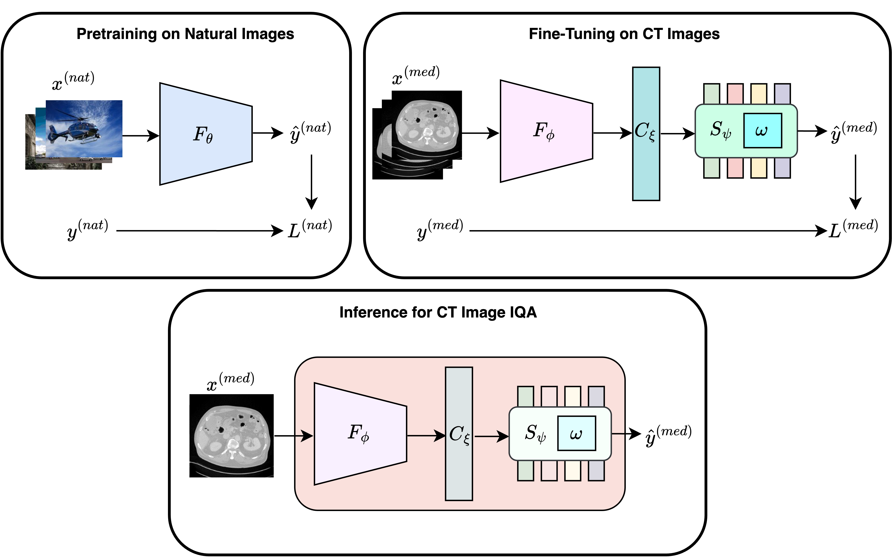

# TFKT V2

## Description

We propose Task-Focused Knowledge Transfer (TFKT), a novel deep learning-based IQA method leveraging knowledge transfer from task-similar natural image datasets. TFKT incorporates a hybrid CNN-Transformer model, enabling accurate quality predictions by learning from natural image distortions with human-annotated mean opinion scores (MOSs). The model is pre-trained on natural image datasets and fine-tuned on LDCTIQA data to ensure task-specific adaptability. Extensive evaluations demonstrate that the proposed TFKT method effectively predicts IQA scores aligned with radiologists’ assessments on in-domain datasets and generalizes well to out-of-domain clinical pediatric CT exams. The model achieves robust performance without requiring high-dose reference images. Our model is capable of assessing the quality of approximately 30 CT image slices in a second.

Schematic diagram of the proposed TFKT V2 method. During the first phase, the EfficientNetV2L backbone network ($F_\\theta$) is trained to predict MOS scores from input natural images. In the second phase, low-dose CT images are fed to the pretrained EfficientNet to extract local features by transferring knowledge from natural image pretraining. A bridge connection ($C_\\xi$) is introduced that connects and feeds extracted local features from EfficientNet ($F_\\phi$) to our modified Swin Transformer (Swin-KAT) ($S_\\psi$) to exploit local-global features and predict the final IQA scores. For inference, the model takes CT image as input and predicts the corresponding IQA score.

---

## Installation

1. Clone the repository and navigate to its directory.
2. Install the required dependencies by running:
   ```bash
   pip install -r requirements.txt
   ```

---

## Download Pretrained Weights

1. Download the pretrained weights from the following link: [XYZ](#)
2. Create a folder named `saved_models` in the root directory of the project.
3. Place the downloaded pretrained weights in the `saved_models` folder.

---

## Running Inference

1. Open the `inference.ipynb` notebook.
2. Follow the steps provided in the notebook to test sample results.

---

## Example Usage

- After setting up the environment and downloading the pretrained weights, you can test the model's performance on your CT images using the provided notebook.

---
## BibTeX
   ```bash
@article{rifa2025tfktv2,
  title     = {TFKT V2: Task-Focused Knowledge Transfer from Natural Images for Computed Tomography Perceptual Image Quality Assessment},
  author    = {Rifa, Kazi Ramisa and Ahmed, Md Atik and Zhang, Jie and Imran, Abdullah-Al-Zubaer},
  booktitle = {Journal of Medical Imaging},
  year      = {2025},
}
   ```

Feel free to reach out if you encounter any issues or have questions!
